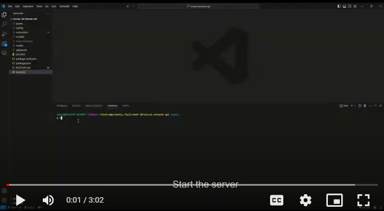

# API For Social Network

## Table Of Contents
* [Description](#description)
* [Installation](#installation)
* [How To Test](#how-to-test)
* [Demo](#demo)
* [Tools](#tools)
* [License](#license)

## Description
Back-end API code for a social networking site.

## Installation
1. Make sure to have [MongoDB](https://www.mongodb.com/try/download/community) and [Node.js](https://nodejs.org/en) installed before continuing
2. Download code files
3. Navigate your CLI to the folder containing the code files
4. Run the code `npm i` to install dependencies from package.json

## How to Test
1. Install the application [Insomnia](https://insomnia.rest/products/insomnia)
2. Navigate your CLI to the folder containing the code files, and run `nodemon server.js` to start the server
3. Now you are able to test all your CRUD routes within Insomnia

## Demo

## Tools
* [MongoDB](https://www.mongodb.com/try/download/community)
* [Node.js](https://nodejs.org/en)
* [Express.js](https://expressjs.com/)
* [Mongoose](https://www.npmjs.com/package/mongoose)
* [Insomnia](https://insomnia.rest/products/insomnia)

## License
